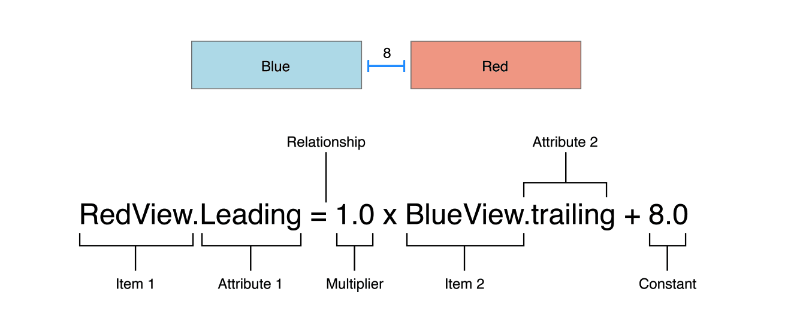

#### 来历

Auto Layout 是苹果的布局引擎。 采用了 [Cassowary constraint-solving](http://constraints.cs.washington.edu/solvers/uist97.html) 算法来约束界面的布局。

#### 原理




上图表示：

>  红色View的前面 = 1.0 * 蓝色View的后面 + 8


一个约束的一般的线性方程如下：

```objective-c
firstItem.firstAttribute {==,<=,>=} secondItem.secondAttribute * multiplier + constant
```


`==,<=,>=`  :  表示约束关系,  一般相同类型才能做约束

`multiplier` : 表示倍数关系，一般用于尺寸

`constant` : 表示常数

`firstAttribute/secondAttribute` : 为视图的布局属性

常见布局属性定义如下:

| 布局属性                                            | 表示意义                                               |
| --------------------------------------------------- | ------------------------------------------------------ |
| NSLayoutAttributeWidth、NSLayoutAttributeHeigh      | 表示视图的尺寸：宽、高                                 |
| NSLayoutAttributeLeft、NSLayoutAttributeRight       | 表示视图的X轴方向的位置：左、右                        |
| NSLayoutAttributeLeading、NSLayoutAttributeTrailing | 表示视图的X轴方向的位置：前、后                        |
| NSLayoutAttributeTop、 NSLayoutAttributeBottom      | 表示视图Y轴方向的位置：顶、底                          |
| NSLayoutAttributeBaseline                           | 表示视图Y轴方向的位置：底部基准线                      |
| NSLayoutAttributeCenterX、NSLayoutAttributeCenterY  | 表示视图的中心点：视图在X轴的中心点、视图在Y轴的中心点 |


#### 代码示例

##### NSLayoutConstraint

创建如下视图的代码:

 

其中绿色视图距离边距20， 蓝色和红色方块水平排列， 红色和紫色方块垂直排列。

```objective-c
- (void)configUI {
    UIView *superView = self.view;
    
    UIView *view1 = [[UIView alloc] init];
    view1.translatesAutoresizingMaskIntoConstraints = NO;
    view1.backgroundColor = [UIColor greenColor];
    [superView addSubview:view1];
    
    UIEdgeInsets padding = UIEdgeInsetsMake(20, 20, -20, -20);
    NSLayoutConstraint *top = [NSLayoutConstraint constraintWithItem:view1
                                                           attribute:NSLayoutAttributeTop
                                                           relatedBy:NSLayoutRelationEqual
                                                              toItem:superView
                                                           attribute:NSLayoutAttributeTop
                                                          multiplier:1.0
                                                            constant:padding.top];
    NSLayoutConstraint *left = [NSLayoutConstraint constraintWithItem:view1
                                                            attribute:NSLayoutAttributeLeft
                                                            relatedBy:NSLayoutRelationEqual
                                                               toItem:superView
                                                            attribute:NSLayoutAttributeLeft
                                                           multiplier:1.0
                                                             constant:padding.left];
    NSLayoutConstraint *bottom = [NSLayoutConstraint constraintWithItem:view1
                                                              attribute:NSLayoutAttributeBottom
                                                              relatedBy:NSLayoutRelationEqual
                                                                 toItem:superView
                                                              attribute:NSLayoutAttributeBottom
                                                             multiplier:1.0
                                                               constant:padding.bottom];
    NSLayoutConstraint *right = [NSLayoutConstraint constraintWithItem:view1
                                                             attribute:NSLayoutAttributeRight
                                                             relatedBy:NSLayoutRelationEqual
                                                                toItem:superView
                                                             attribute:NSLayoutAttributeRight
                                                            multiplier:1.0
                                                              constant:padding.right];
    [superView addConstraints:@[top, left, bottom, right]];
    
    // view2 is topleft in view1
    UIView *view2 = [[UIView alloc] init];
    view2.translatesAutoresizingMaskIntoConstraints = NO;
    view2.backgroundColor = [UIColor blueColor];
    [view1 addSubview:view2];
    
    NSLayoutConstraint *top2 = [NSLayoutConstraint constraintWithItem:view2
                                                            attribute:NSLayoutAttributeTop
                                                            relatedBy:NSLayoutRelationEqual
                                                               toItem:view1
                                                            attribute:NSLayoutAttributeTop
                                                           multiplier:1.0 constant:20];
    NSLayoutConstraint *left2 = [NSLayoutConstraint constraintWithItem:view2
                                                             attribute:NSLayoutAttributeLeft
                                                             relatedBy:NSLayoutRelationEqual
                                                                toItem:view1
                                                             attribute:NSLayoutAttributeLeft
                                                            multiplier:1.0
                                                              constant:20];
    NSLayoutConstraint *width2 = [NSLayoutConstraint constraintWithItem:view2
                                                              attribute:NSLayoutAttributeWidth
                                                              relatedBy:NSLayoutRelationEqual
                                                                 toItem:nil
                                                              attribute:NSLayoutAttributeNotAnAttribute
                                                             multiplier:1.0
                                                               constant:100];
    NSLayoutConstraint *height2 = [NSLayoutConstraint constraintWithItem:view2
                                                               attribute:NSLayoutAttributeHeight
                                                               relatedBy:NSLayoutRelationEqual
                                                                  toItem:nil
                                                               attribute:NSLayoutAttributeNotAnAttribute
                                                              multiplier:1.0
                                                                constant:100];
    [view1 addConstraints:@[top2, left2, width2, height2]];
    
    
    // view3 is horizontal with view2
    UIView *view3 = [[UIView alloc] init];
    view3.translatesAutoresizingMaskIntoConstraints = NO;
    view3.backgroundColor = [UIColor redColor];
    [view1 addSubview:view3];
    
    NSLayoutConstraint *right3 = [NSLayoutConstraint constraintWithItem:view3
                                                              attribute:NSLayoutAttributeRight
                                                              relatedBy:NSLayoutRelationEqual
                                                                 toItem:view1
                                                              attribute:NSLayoutAttributeRight
                                                             multiplier:1.0
                                                               constant:-20];
    NSLayoutConstraint *top3 = [NSLayoutConstraint constraintWithItem:view3
                                                            attribute:NSLayoutAttributeTop
                                                            relatedBy:NSLayoutRelationEqual
                                                               toItem:view2
                                                            attribute:NSLayoutAttributeTop
                                                           multiplier:1.0
                                                             constant:0];
    NSLayoutConstraint *width3 = [NSLayoutConstraint constraintWithItem:view3
                                                              attribute:NSLayoutAttributeWidth
                                                              relatedBy:NSLayoutRelationEqual
                                                                 toItem:view2
                                                              attribute:NSLayoutAttributeWidth
                                                             multiplier:1.0
                                                               constant:0];
    NSLayoutConstraint *heigh3 = [NSLayoutConstraint constraintWithItem:view3
                                                              attribute:NSLayoutAttributeHeight
                                                              relatedBy:NSLayoutRelationEqual
                                                                 toItem:view2
                                                              attribute:NSLayoutAttributeHeight
                                                             multiplier:1.0
                                                               constant:0];
    [view1 addConstraints:@[right3, top3, width3, heigh3]];
    
    
    // view4 is horizontal with view3
    UIView *view4 = [[UIView alloc] init];
    view4.translatesAutoresizingMaskIntoConstraints = NO;
    view4.backgroundColor = [UIColor purpleColor];
    [view1 addSubview:view4];
    
    NSLayoutConstraint *right4 = [NSLayoutConstraint constraintWithItem:view4
                                                              attribute:NSLayoutAttributeRight
                                                              relatedBy:NSLayoutRelationEqual
                                                                 toItem:view3
                                                              attribute:NSLayoutAttributeRight
                                                             multiplier:1.0
                                                               constant:0];
    NSLayoutConstraint *top4 = [NSLayoutConstraint constraintWithItem:view4
                                                            attribute:NSLayoutAttributeTop
                                                            relatedBy:NSLayoutRelationEqual
                                                               toItem:view3
                                                            attribute:NSLayoutAttributeBottom
                                                           multiplier:1.0
                                                             constant:30];
    NSLayoutConstraint *width4 = [NSLayoutConstraint constraintWithItem:view4
                                                              attribute:NSLayoutAttributeWidth
                                                              relatedBy:NSLayoutRelationEqual
                                                                 toItem:view3
                                                              attribute:NSLayoutAttributeWidth
                                                             multiplier:1.0
                                                               constant:0];
    NSLayoutConstraint *heigh4 = [NSLayoutConstraint constraintWithItem:view4
                                                              attribute:NSLayoutAttributeHeight
                                                              relatedBy:NSLayoutRelationEqual
                                                                 toItem:view3
                                                              attribute:NSLayoutAttributeHeight
                                                             multiplier:1.0
                                                               constant:0];
    [view1 addConstraints:@[right4, top4, width4, heigh4]];
}

```


##### NSLayoutAnchor

iOS 9.0 之后， 出现了一种 NSLayoutAnchor 约束， 能大大简化布局代码。

```objective-c
- (void)configUI {
    UIView *yellow = [[UIView alloc] init];
    yellow.translatesAutoresizingMaskIntoConstraints = NO;
    yellow.backgroundColor = UIColor.yellowColor;
    [self.view addSubview:yellow];
    
    UIView *green = [[UIView alloc] init];
    green.translatesAutoresizingMaskIntoConstraints = NO;
    green.backgroundColor = UIColor.greenColor;
    [yellow addSubview:green];
    
    UIView *red = [[UIView alloc] init];
    red.translatesAutoresizingMaskIntoConstraints = NO;
    red.backgroundColor = UIColor.redColor;
    [yellow addSubview:red];
    
    CGFloat margin = 20;
    [yellow.leadingAnchor  constraintEqualToAnchor:self.view.leadingAnchor constant:margin].active = YES;
    [yellow.trailingAnchor constraintEqualToAnchor:self.view.trailingAnchor constant:-margin].active = YES;
    [yellow.topAnchor      constraintEqualToAnchor:self.view.topAnchor constant:100].active = YES;
    [yellow.bottomAnchor   constraintEqualToAnchor:self.view.bottomAnchor constant:-margin].active = YES;
    
    [green.leadingAnchor   constraintEqualToAnchor:yellow.leadingAnchor constant:margin].active = YES;
    [green.trailingAnchor  constraintEqualToAnchor:yellow.trailingAnchor constant:-margin].active = YES;
    [green.topAnchor       constraintEqualToAnchor:yellow.topAnchor constant:margin].active = YES;
    [green.bottomAnchor    constraintEqualToAnchor:red.topAnchor constant:-margin].active = YES;
    
    [red.leadingAnchor     constraintEqualToAnchor:green.leadingAnchor].active = YES;
    [red.trailingAnchor    constraintEqualToAnchor:green.trailingAnchor].active = YES;
    [red.bottomAnchor      constraintEqualToAnchor:yellow.bottomAnchor constant:-margin].active = YES;
    [red.heightAnchor      constraintEqualToAnchor:green.heightAnchor multiplier:1.5].active = YES;
    
}
```


[Unterstanding Auto Layout](https://developer.apple.com/library/archive/documentation/UserExperience/Conceptual/AutolayoutPG/index.html)

[自动布局Auto Layout(原理篇)](https://www.jianshu.com/p/3a872a0bfe11)

